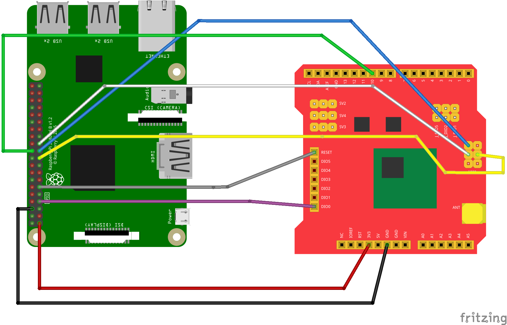

pyRadioHeadRF95
===============
**pyRadioHeadRF95** is a Python wrapper for the use of *RH_RF95* class of the *RadioHead* library on a Raspberry Pi.

The library is developed and tested using a Dragino LoRa shield.

Requirements:
---------
- bcm2835 (http://www.airspayce.com/mikem/bcm2835) 
- cffi (http://cffi.readthedocs.io/en/latest/index.html)


Compiling:
----------
Move to the main directory and run:

	make

Wirings (Dragino LoRa shield):
----------


Writing programs using pyRadioHeadRF95
---------------------------------------
- Import the module: ```import pyRadioHeadRF95 as Radio```
* If the program is in a different directory, the path to pyRadioHeadRF95 need to be added to PYTHONPATH

### Using directly the Driver with no Manager
- Instantiate an object of the ```RF95``` class: ```rf95 = Radio.RF95()```
- Call the initalizer: ```rf95.init()```
- Set the frequency: ```rf95.setFrequency(<FREQ>)```
- Set radio transmission power: ```rf95.setTxPower(<dBm>, <useRFO>)```

#### Configuring Bandwidth
Done via the method ```rf95.setSignalBandwidth(<BW>)```

Possible values are listed in ```pyRadioHeadRF95.py```

#### Configuring Spreading Factor 
Done via the method ```rf95.setSpreadingFactor(<SF>)```

Possible values are listed in ```pyRadioHeadRF95.py```

#### Configuring Coding Rate
Done via the method ```rf95.setCodingRate4(<CR_DEN>)```

Possible values are listed in ```pyRadioHeadRF95.py```

#### Sending and Receiving
	
	rf95.send(msg, len(msg))  
	rf95.waitPacketSent()  
	
	
	if rf95.available():  
        (msg, l) = rf95.recv()    


### Using the ReliableDatagram Manager
- Instantiate an object of the ```RF95``` class: ```rf95 = Radio.RF95()``` and initialize it as explained above
- Call the initalizer: ```rf95.managerInit(<MY_ADDRESS>)```, where the address is an integer


#### Sending and Receiving
	
	rf95.sendtoWait(msg, len(msg), destination)  
	
	
	if rf95.available():  
         (msg, l, source) = rf95.recvfromAck()
         
Running Examples:
-----------------
Once the package is compiled run:

	sudo ./examples/rf_server.py

or

	sudo ./examples/rf_reliable_server.py
